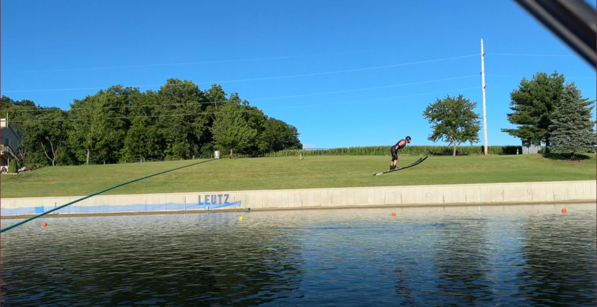
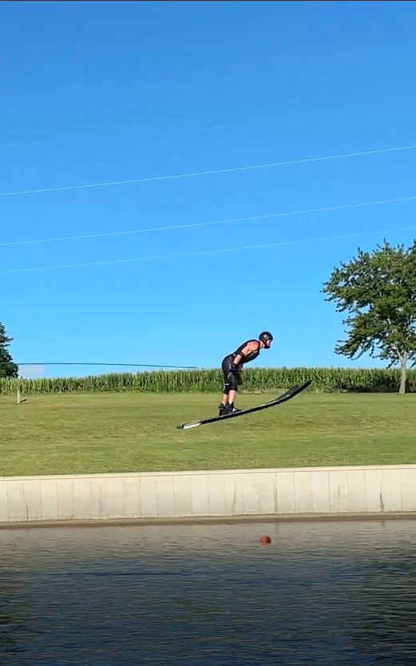

# Ski Video Editor

   

An AI-powered video processing application that automatically converts landscape waterski footage into social-media-optimized vertical (9:16) video by tracking the skier throughout the clip and dynamically reframing in real time.

**Live demo:** https://ski-video-editor.vercel.app

---

## Overview

Modern social media platforms prioritize vertical video, but fast-paced sports footage is almost always captured in landscape orientation. This project solves that with computer vision — detecting and tracking the athlete frame-by-frame to generate a smooth, cropped vertical output ready for Instagram Reels, TikTok, and YouTube Shorts. No manual editing required.

The application takes a standard widescreen input and automatically:
- Detects the waterskier using a YOLOv8 person detection model
- Tracks skier movement frame-by-frame with a multi-state tracking engine
- Calculates dynamic crop positioning with EMA smoothing and hard per-frame speed clamping
- Generates a smooth 9:16 vertical output at full resolution
- Preserves the original audio track

---

## Demo

### Original Landscape Video



### Generated Vertical Output



---

## Features

### YOLOv8 Subject Tracking
Runs YOLOv8s inference on each frame (downsampled to 1280px for speed, scaled back for full-res cropping) to detect and follow the skier across the entire clip. Includes a size-sanity filter to reject false positives from the boat, canopy, and water spray.

### Multi-State Tracking Engine
A purpose-built state machine (TRACKING → COASTING → REACQUIRING) handles the full range of real-world conditions: detection gaps from spray or backlight, fast lateral motion, and airborne phases during jump events. Supports two modes:
- **Slalom** — optimized for fast side-to-side motion with velocity coasting when the skier is briefly lost
- **Jump** — adds an AIRBORNE state that detects when the skier leaves the ramp and switches to ultra-slow panning, since the background is static during the arc

### Smooth, Snap-Free Output
EMA smoothing on the crop position is combined with a hard per-frame speed clamp as a final safety net — nothing bypasses it. A detection averaging buffer (5–7 frames) absorbs YOLO jitter before it can affect the crop, and a miss-grace window prevents single-frame flickers from triggering unnecessary state transitions.

### Serverless GPU Backend
Processing runs on Modal's serverless GPU infrastructure. A polling architecture (upload → get call ID → poll status → fetch result) was used to avoid Modal's 150-second web endpoint timeout, keeping the frontend responsive on large 4K video files.

### Social Media Ready Output
- 9:16 aspect ratio (1080×1920)
- Full-resolution crop from 4K source
- Original audio preserved and synchronized

---

## Tech Stack

| Layer | Technology |
|---|---|
| Object Detection | YOLOv8s (Ultralytics) |
| Video Processing | Python, OpenCV |
| Backend Compute | Modal Serverless GPU |
| Frontend | HTML, CSS, JavaScript |
| Hosting | Vercel |

---

## Architecture

```
User (browser)
    │
    ▼
index.html (Vercel)
    │  POST /upload
    ▼
Modal upload endpoint
    │  enqueues async job, returns call_id
    ▼
Modal process_video (GPU)
    ├── YOLO inference per frame
    ├── State machine: TRACKING / COASTING / REACQUIRING / AIRBORNE
    ├── EMA smoothing + hard speed clamp
    └── ffmpeg audio merge
    │
    ▼
Modal result endpoint
    │  browser polls /status → /result
    ▼
User downloads vertical video
```

**Backend endpoints:**
- `POST /upload` — accepts video, enqueues processing, returns `call_id`
- `GET /status?call_id=...` — returns job state (queued / running / complete)
- `GET /result?call_id=...` — returns processed video on completion

---

## Local Development

```bash
# Clone the repo
git clone https://github.com/bleutz1/ski-video-editor
cd ski-video-editor

# Install Python dependencies
pip install ultralytics opencv-python numpy

# Run slalom reframe
python slalom.py input.mov output.mp4

# Run jump reframe
python jump.py input.mov output.mp4
```

**Common tuning flags:**
```bash
# Adjust tracking sensitivity
python slalom.py input.mov output.mp4 --conf 0.20 --smooth 0.18 --max_speed 100

# Enable debug CSV logging (uncomment debug_log lines in script first)
python jump.py input.mov output.mp4 --conf 0.12 --air_smooth 0.04
```

---

## Motivation

This project was created to solve a practical problem in waterski media production: converting landscape jump and slalom footage originally used for coaching and self-coaching into engaging short-form social-media-ready content without requiring manual video editing.

As an athlete and engineer, this project combines my interests in sports, software development, and applying engineering concepts to real-world problems.

---

## Author

**Ben Leutz**  
Aerospace Engineer | Controls & Simulation  
[LinkedIn](https://www.linkedin.com/in/ben-leutz/) · [GitHub](https://github.com/bleutz1)
