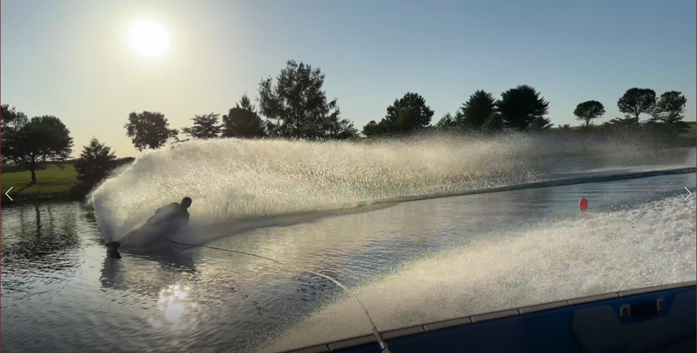
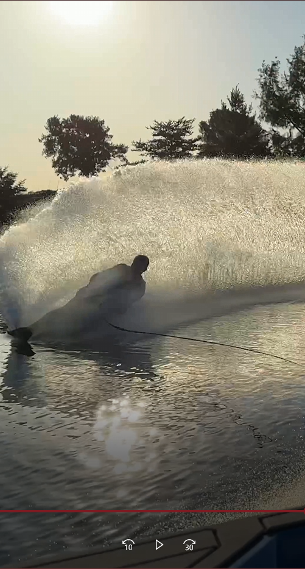

# Ski Video Editor

An AI-assisted video processing application that automatically converts traditional landscape waterski videos into social media optimized vertical (9:16) videos by tracking the skier throughout the clip and dynamically reframing the camera view.

## Overview

Modern social media platforms prioritize vertical video formats, but most action sports footage is captured in traditional landscape orientation. This project solves that problem by using computer vision techniques to identify and track the athlete, keeping the skier centered while generating a cropped vertical video suitable for platforms such as Instagram Reels, TikTok, and YouTube Shorts.

The application takes a standard widescreen video input and automatically:
- Detects the waterskier throughout the video
- Tracks skier movement frame-by-frame
- Calculates dynamic crop positioning
- Generates a smooth 9:16 vertical output
- Maintains focus on the athlete during high-speed motion

## Demo

### Original Landscape Video

Traditional widescreen waterski footage:

### Generated Social Media Format

Automatically reframed vertical video with skier tracking:

## Features

### Automated Subject Tracking
Uses computer vision-based tracking to follow the skier as they move across the frame, reducing the need for manual editing.

### Dynamic Video Reframing
Instead of applying a static crop, the application adjusts the crop window throughout the video to keep the athlete visible.

### Social Media Optimization
Outputs videos in a 9:16 aspect ratio optimized for:
- Instagram Reels
- TikTok
- YouTube Shorts

### Web-Based Interface
Provides a simple interface for uploading videos and generating processed clips.

## Technology Stack

- Python
- OpenCV
- Computer Vision / Object Tracking
- Video Processing
- Flask
- HTML/CSS/JavaScript
- Vercel Deployment

## Project Architecture

1. User uploads a landscape video
2. Video frames are extracted and analyzed
3. The skier position is detected/tracked
4. A dynamic crop window follows the skier
5. Frames are recombined into a vertical video output

## Future Improvements

Potential enhancements:
- Improved object detection using deep learning models
- Multi-athlete tracking
- Automatic highlight detection
- Motion prediction for smoother camera movement
- Cloud-based video processing pipeline
- Audio preservation and optimization

## Motivation

This project was created to solve a practical problem in waterski media production: converting long-distance jump and slalom footage into engaging short-form content without requiring manual video editing.

As an athlete and engineer, this project combines my interests in sports, software development, and applying engineering concepts to real-world problems.

## Author

Ben Leutz  
Aerospace Engineer | Controls & Simulation | Computer Vision Applications